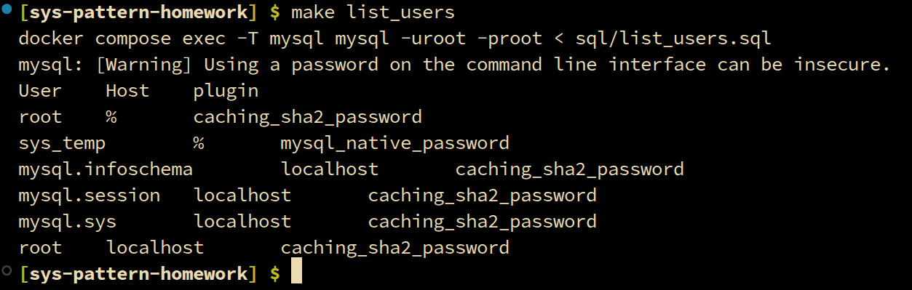
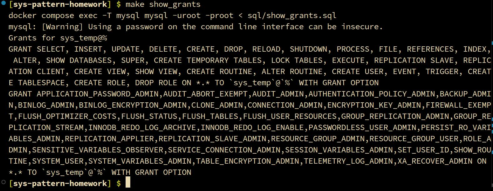
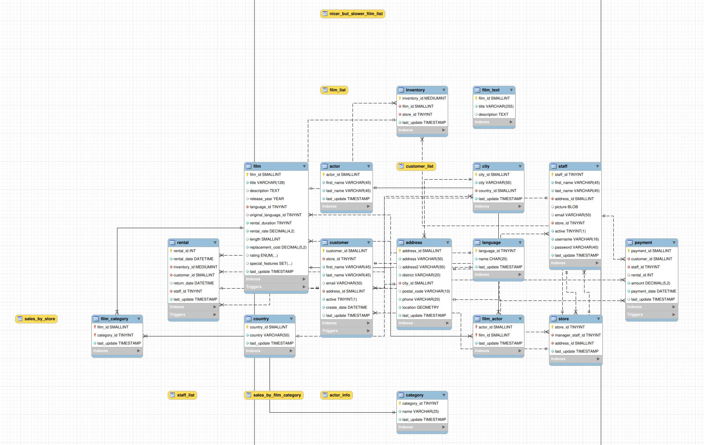
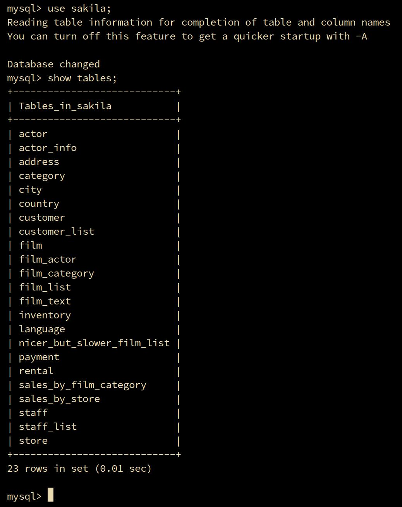
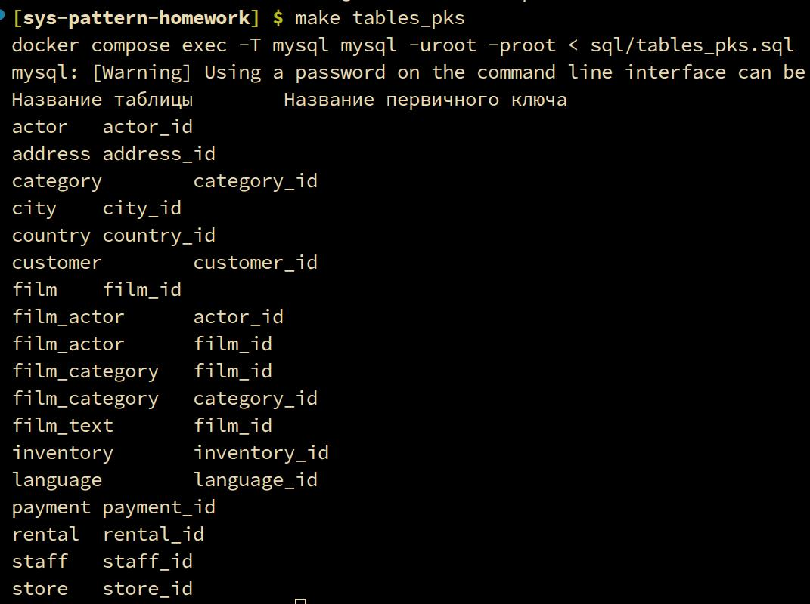
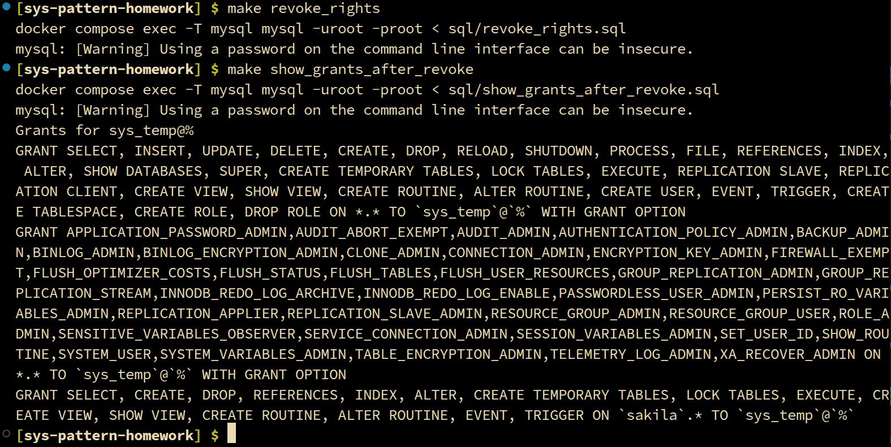

# Домашнее задание к занятию Работа с данными (DDL/DML)

Зарифов Руслан

---

## Задание 1

### Запуск

Для запуска контейнера выполняем следующие команды:

```
make up
make sakila_restore
make create_user
make grant_all
```

Стягивается и поднимается образ MySQL 8;  
Скачивается и распаковывается файл sakila-db.zip;  
Накатываются sql на нашу базу из архива;  
Создаётся пользователь sys_temp с помощью запроса `sql/create_user.sql`;  
Меняются права нашего sys_temp на полные. Файл `sql/grant_all.sql`;  

Отдельно отмечу что при создании был использован mysql_native_password чтобы уменьшить головную боль в дальнейшем.

---

### Пользователи и права

Для печати списка пользователей используется команда `make list_users`:

**List of users:**


---

Для того, чтобы показать все привилегии пользователя sys_temp используется команда `make show_grants`:

**List of privileges of sys_temp:**


---

### Реверс инжиниринг и таблицы:

Реверс инжиниринг схемы возможен средствами MySQL Workbench:


Запускаем workbench, присоединяемся к базе, в верхней панели выбираем Database -> Reverse Engineer, следуем пошагово по диалоговым окнам.

---

Таблицы sakila:


Выполнение, через mysql:
```
make mysql_sys_temp
```

затем:
```
use sakila;
show tables;
```

---

## Задание 2

### Чтобы составить таблицу для Excel с двумя столбцами нужно выполнить команду `make tables_pks`:


---

## Задание 3

### Удаление прав пользователя sys_temp:
Исполняется командой `make revoke_rights`, который запускает файл `sql/revoke_rights.sql`.

